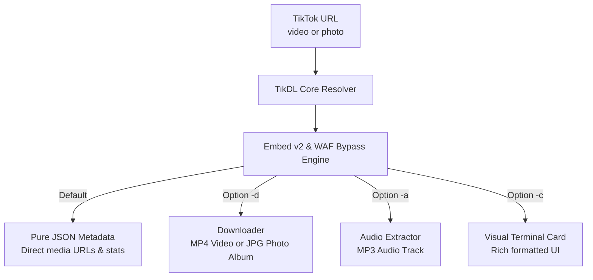

# TikDL

<p align="center">
  <a href="https://pypi.org/project/tikdl/"></a>
  <a href="https://pypi.org/project/tikdl/"></a>
  <a href="https://www.python.org/"></a>
  <a href="LICENSE"></a>
  <a href="https://github.com/sanzydev/TikDL"></a>
</p>

<p align="center">
  <b>Fast, minimal CLI tool to inspect metadata (JSON) and download public TikTok videos, photo albums, and audio.</b>
</p>

<p align="center">
  Available for: <b>Python (PyPI)</b> | <a href="https://github.com/sanzydev/tikdl-js"><b>JavaScript / Node.js (npm)</b></a>
</p>

---

## Ecosystem

TikDL is available in both Python and JavaScript / Node.js implementations:

| Language | Registry | Quick Run / Install | Repository |
| :--- | :--- | :--- | :--- |
| **Python** | [](https://pypi.org/project/tikdl/) | `pip install tikdl` | [sanzydev/TikDL](https://github.com/sanzydev/TikDL) *(this repo)* |
| **JavaScript / Node.js** | [](https://www.npmjs.com/package/tikdl) | `npx tikdl <url>` | [sanzydev/tikdl-js](https://github.com/sanzydev/tikdl-js) |

---

## Architecture Flow



---

## Features

- **Zero Headless Browser Overhead** – No heavy Selenium, Playwright, or Chrome required. Powered by direct streaming HTTP client.
- **Built-in WAF Bypass** – Resilient against TikTok security challenges and anti-bot verification.
- **Full Photo Slideshow Support** – Extracts and batch downloads all high-resolution images from photo posts.
- **Direct Audio Download** – Grab public background audio tracks directly as `.mp3` with `-a`.
- **Pure JSON Metadata** – First-class JSON output format, ready for scripting or piping into `jq`.
- **Interactive Terminal UI** – Smooth download progress bars and styled visual cards powered by Rich.

---

## Installation

Install directly from **[PyPI](https://pypi.org/project/tikdl/)**:

```bash
pip install tikdl
```

Or install from source:

```bash
git clone https://github.com/sanzydev/TikDL.git
cd TikDL
pip install -e .
```

---

## Usage

### 1. View Metadata (JSON)
Outputs clean JSON without downloading any files:

```bash
tikdl "https://www.tiktok.com/@user/video/1234567890"
```

Pipe directly into `jq`:
```bash
tikdl "https://www.tiktok.com/@user/video/1234567890" | jq .video_url
```

### 2. Download Video or Photo Album (`-d`)
Downloads MP4 video file, or all JPG photos if the post is a slideshow:

```bash
# Download video
tikdl "https://www.tiktok.com/@user/video/1234567890" -d

# Download all photos from slideshow
tikdl "https://www.tiktok.com/@user/photo/1234567890" -d
```

### 3. Download Audio Only (`-a`)
Extracts and saves the background music track as `.mp3`:

```bash
tikdl "https://www.tiktok.com/@user/video/1234567890" -a
```

### 4. Visual Card View (`-c`)
Displays a formatted terminal summary card:

```bash
tikdl "https://www.tiktok.com/@user/video/1234567890" -c
```

### 5. Batch Download (`-f`)
Download multiple URLs from a text file:

```bash
tikdl -f urls.txt -d
```

---

## CLI Reference

| Flag | Description |
| :--- | :--- |
| `urls` | One or more TikTok video or photo URLs |
| `-d, --download` | Download video (MP4) or photo album (JPG) |
| `-a, --audio` | Download audio track only (MP3) |
| `-o, --output <dir>` | Destination directory (default: `./downloads`) |
| `-f, --file <file>` | Read URLs from text file (one URL per line) |
| `-c, --card` | Display visual terminal card instead of raw JSON |
| `--debug` | Enable verbose diagnostic logging |
| `-v, --version` | Show application version |

---

## Star History

<p align="center">
  <a href="https://star-history.dera.page/#sanzydev/TikDL&Date">
    <picture>
      <source media="(prefers-color-scheme: dark)" srcset="https://api.star-history.com/svg?repos=sanzydev/TikDL&type=Date&theme=dark" />
      <source media="(prefers-color-scheme: light)" srcset="https://api.star-history.com/svg?repos=sanzydev/TikDL&type=Date" />
      
    </picture>
  </a>
</p>

---

## License

Distributed under the [MIT License](LICENSE). Developed by [@sanzydev](https://github.com/sanzydev).
